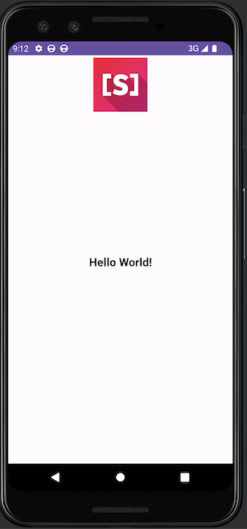

## How to Create a Hello World Application

  - Open Android Studio.

  - Begin a new project by selecting "File" > "New" > "New Project."


  - Choose a suitable template; for this guide, select "Empty Views Activity."

    - **Note:** Ensure you choose "Empty Views Activity," not "Empty Activity."

  - Provide project details such as name (e.g., SwiftAndroidExample) and package name (e.g., com.example.myapplication).

  - Click "Next" to proceed.

### Initializing Swift Package Manager (SPM) Project

To create a new Swift Package Manager (SPM) project within the `app/src/main/swift` subdirectory, run the following commands in the terminal:

```bash

cd SwiftAndroidExample/app/src/main/swift

swift package init --name SwiftAndroidExample

```

It will set up a new SPM project named SwiftAndroidExample inside the `swift` subdirectory. This project structure allows you to efficiently manage Swift dependencies and build your Swift code as a separate module within your Android Studio project.


### Configure Gradle in build.gradle

  - In your Android project, access the `app/build.gradle` file.

  - Enhance the `android` section by adding:

    ```gradle
    android {
        sourceSets {
            main {
                jniLibs.srcDirs = ["lib"]
            }
        }
    }
    ```

    This informs Gradle to locate JNI libraries in the lib subdirectory.

  - In the `dependencies` section, include:

    ```gradle

    implementation fileTree(dir: 'lib', include: ['*.jar'])

    ```

    This line instructs Gradle to include .jar libraries in the resulting APK.

  - At the end of `build.gradle`, insert the following custom Gradle task:

    ```gradle

    task buildSwiftProject(type: Exec) {

        commandLine 'scd',

                'archive', '--type', 'android',

                '--path', 'src/main/swift',

                '--platform', 'android-arm64-v8a',

                '--platform', 'android-x86_64'
    }

    tasks.whenTaskAdded { task ->

        if (task.name == 'assembleDebug' || task.name == 'assembleRelease') {

            task.dependsOn buildSwiftProject

        }

    }

    ```

### Initialize Swift Runtime and Load JNI Library

  - In `MainActivity.java`, add Swift runtime initialization in the `onCreate` method:

    ```java

    @Override

    protected void onCreate(Bundle savedInstanceState) {

        super.onCreate(savedInstanceState);

        setContentView(R.layout.activity_main);

        try {

            org.swift.swiftfoundation.SwiftFoundation.Initialize(this, false);

        } catch (Exception err) {

            android.util.Log.e("Swift", "Can't initialize Swift Foundation: " + err.toString());

        }

        // Continue with your activity code

    }

    ```

  - Load the JNI library using:

    ```java

    System.loadLibrary("SwiftAndroidExample");

    ```

### Java Methods Calling Swift Implementation

In your Android application, you can declare Java methods that serve as bridges to Swift code. The implementation of these methods will be written in Swift, allowing seamless integration between the two languages. Here's an example:

```java

public class MainActivity extends AppCompatActivity {

    // Declare a native method in Java, with the implementation in Swift

    public native void printHelloWorld();

    // This method is called from Swift code, and the result is sent as an input parameter

    public void printText(String validationResult) {

        // Assuming headerTV is a TextView in your layout

        headerTV.setText(validationResult);
    }

    // ... Rest of your MainActivity code
}

```

The Swift implementation of `printHelloWorld` and the Swift code calling `printText` will complete the interaction between Java and Swift, providing a seamless integration of functionalities in your Android application.

### Swift Implementation for Java Methods

The `MainActivity_printHelloWorld` function is annotated with @_silgen_name to set the native name for the function when called from Java. It takes the JNI environment (env) and the Java activity (activity) as parameters. Inside this function, you create a JObject wrapper for the Java activity and call the updateTasksList function to perform the desired interaction with the Java code.

```swift

import Dispatch

import Foundation

import Java

// Function to update tasks list in Java

public func updateTasksList(activity: JObject) {

  // Call the Java method "printText" with the message "Hello World!"

  activity.call(method: "printText", "Hello World!")

}

// Use @_silgen_name attribute to set native name for a function called from Java

@_silgen_name("Java_com_example_swiftandroidexample_MainActivity_printHelloWorld")

public func MainActivity_printHelloWorld(

  env: UnsafeMutablePointer<JNIEnv>, activity: JavaObject

) {

  // Create JObject wrapper for the activity object

  let mainActivity = JObject(activity)

  // Call the Swift function to update tasks list in Java

  updateTasksList(activity: mainActivity)

}

```

This Swift code demonstrates the integration of Swift functions with Java methods, allowing for bidirectional communication between Swift and Java in your Android application.

### Run the Hello World App 

Run the Android Appusing Swift’s code like you would run any Android project in Android Studio,  on Android Emulator/Physical device. You should be able to see Hello World.




**Source Code:** Please find the source code of Hello World App(Swift for Android) [here](https://github.com/6vedant/swift-for-android-hello-world)

