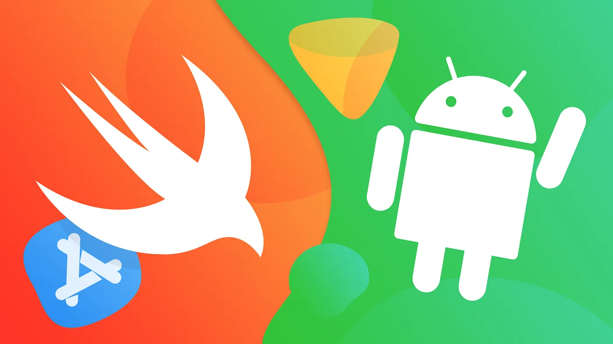

# Getting Started with Swift for Android



## Prerequisites

Before you begin Swift development for Android, make sure you have the following tools installed:

1. **Xcode (For macOS):**
   If you don't have Xcode installed, it is recommended to install it from the Mac App Store. Xcode includes Swift, and the installation of Xcode will automatically include Swift as part of the development tools.

2. **Android Studio:**
   Android Studio is the official integrated development environment (IDE) for Android app development. You can download Android Studio from the official website: [Android Studio Download](https://developer.android.com/studio).

3. **SCADE IDE (Optional):**
   If you are interested in using Scade for Swift development, you can download it from SCADE's official website: [Scade Download](https://www.scade.io/download).

## 2. How to Install Swift for Android

### For macOS
Before setting up Swift for Android, ensure that you have Android Studio installed on your macOS. Follow these steps:

- **Install Android Studio:**

  - Download Android Studio.
  - Run the downloaded installer and follow the setup instructions.
  - Launch Android Studio eand complete the initial configuration, including the installation of the Android SDK.
  - Install Android NDK, by clicking on Tools -> SDK Manager -> SDK Tools tab. Select the NDK(side by side) and CMake checkboxes. Click OK to download and install.
  - [Install Android Emulator](https://developer.android.com/studio/run/emulator) if you want to run on Android emulators

- **Install Swift Toolchain for Android:**

  - Download Swift Toolchain for Android
  - Run the downloaded installer and follow the setup instructions.

- **Verify Swift Toolchain (Already Included in SCADE IDE):**

  In the terminal, check with the below commands if Swift Toolchain for Android is installed or not. The following command should print the installed Swift Toolchain version:
    ```bash
       scd list-installed
    ```

### For Linux

Currently Swift for Android is available for macOS only. It will be available for Linux very soon.

## 3. Next Steps: Create a Hello World App on Android Studio using Swift
Refer [here](HowToCreateHelloWorldApp.md) to quickly create and run the app on Android Studio using Swift.
